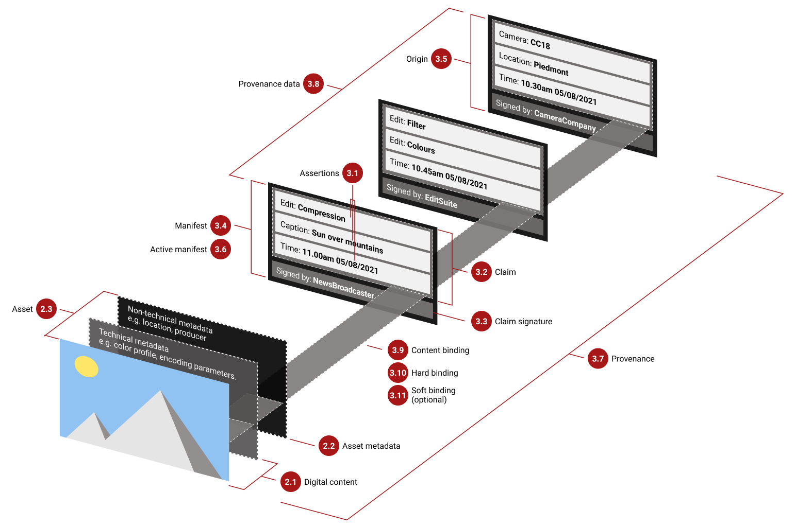

## Overview

The Content Authenticity Initiative's open-source offerings consist of:

- The JavaScript SDK
- The c2patool command-line tool
- The Rust SDK

These projects all work with _C2PA manifest data_ (also referred to as just "manifest data") that contains information about the provenance of a digital asset. For more details, see [Key concepts](#key-concepts) below.

### JavaScript SDK

The [JavaScript SDK](js-sdk/getting-started/overview) enables **working with manifest data in the browser**. Use this SDK to:

- Verify and display manifest data on a website or web application.
- Link manifest data displayed on your site to [Verify](https://verify.contentauthenticity.org/).
- Easily add user interface elements to your website that display manifest data while following the [C2PA user experience recommendations](https://c2pa.org/specifications/specifications/1.0/ux/UX_Recommendations.html).

### c2patool

[c2patool](c2patool) is a **command-line utility for working with C2PA manifest data**. Use this tool to work with assets in a supported file format to:

- Read a JSON report of manifest data.
- Attach a manifest store to an asset, if it doesn't already have an associated manifest store.
- Add a manifest to to the associated manifest store if the asset does have an associated manifest store.

### Rust SDK

The [Rust SDK](rust-sdk) enables **adding C2PA capabilities to a desktop, mobile, or embedded application**. Use the Rust SDK to:

- Create and sign C2PA claims and manifests.
- Embed a manifest store into certain asset file formats.
- Parse and validate manifests found in certain asset file formats.

## Key concepts

Regardless of which SDK or tool you use, it's important to understand some key concepts. These definitions are based on the [glossary in the C2PA Technical Specification](https://c2pa.org/specifications/specifications/1.3/specs/C2PA_Specification.html#_glossary).

**Asset**: A file or stream of data containing _digital content_, asset metadata and optionally, a _C2PA manifest_.

**Composed asset**: An _asset_ created by building up a collection of multiple parts or fragments of [digital content](https://c2pa.org/specifications/specifications/1.3/specs/C2PA_Specification.html#_digital_content) (referred to as ingredients) from one or more other assets. For example, a composed asset could be an image (image A) with another image (image B) imported and super-imposed on top of it. In this example, image B is referred to as an _ingredient_.

**C2PA manifest**: The set of information about the provenance of an asset based on the combination of one or more _assertions_ (including content bindings), a single _claim_, and a _claim signature_. A _C2PA manifest_ is part of a _C2PA manifest store_.

**C2PA manifest store**: A collection of _C2PA manifests_ that can either be embedded into an asset or be external to it.

**Active manifest**: The last manifest in the list of _C2PA manifests_ inside of a _C2PA manifest store_ which is the one with the set of _content bindings_ that are able to be validated.

**Assertion**: A data structure which represents a statement asserted by an _actor_ concerning the _asset_. This data is part of the _C2PA manifest_. For a list of standard C2PA assertions, see [C2PA Technical Specification](https://c2pa.org/specifications/specifications/1.3/specs/C2PA_Specification.html#_c2pa_standard_assertions).

**Ingredient**: Part of a _composed asset_, such as an image superimposed on top of another image.

The following diagram illustrates how the concepts are related to each other in the C2PA architecture.

